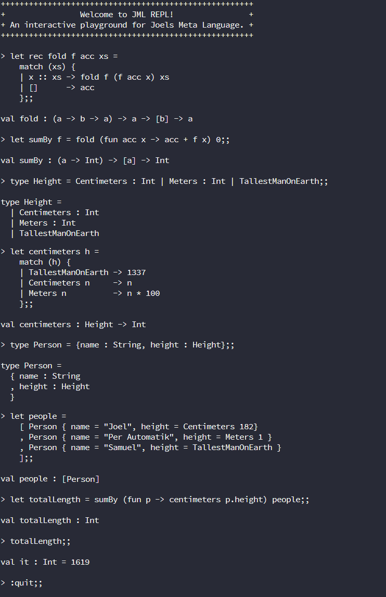

# Joel's Meta Language - a carefully selected subset of ML.



## Commands
* `:quit` - quits the REPL
* `:clear` - clears the screen
* `:show nothing` - sets lowest level of verbosity
* `:show something` - sets medium level of verbosity
* `:show everything` - sets highest level of verbosity

## Instructions
1. Clone the source with git and change directory. 
```
$ git clone https://github.com/johesoman/jml.git
$ cd jml
```

2. Build and run the code. 
```
$ dotnet run
```

3. To evaluate an expression, write it and end with `;;`, and then press by <enter>.
```
> 1 + 2;;

val it : Int = 3
```
